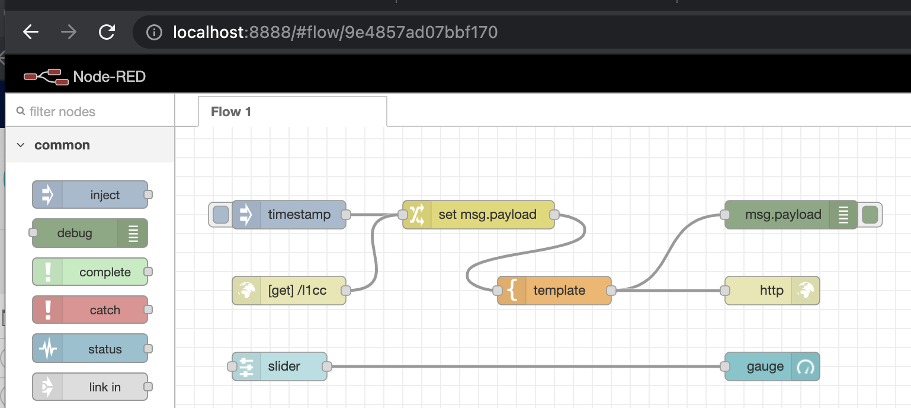

# linuxONE-node-red

## setup
+ you will need node.js at nodejs10+
```
sudo yum install nodejs
```
+ if you plan to use any nodes  beyond the core (Db2  for example), you will  need build utilities (make, gcc, etc)
```
sudo yum install "Developer Tools"
```
+ use the linux install script provided by the Node-RED project [installer](https://github.com/node-red/linux-installers) and select appropriate distribution
  + rpm/yum
  ```
  bash <(curl -sL https://raw.githubusercontent.com/node-red/linux-installers/master/rpm/update-nodejs-and-nodered)
  ```
  + deb (Ubuntu)
  ```
  bash <(curl -sL https://raw.githubusercontent.com/node-red/linux-installers/master/deb/update-nodejs-and-nodered)
  ```
  + sles - just use the basic `sudo npm install -g --unsafe-perm node-red` but make sure you install the Developer Tools
+ add Db2 support via `cd ~/.node-red; npm install node-red-contrib-ibm-db2`
<pre>
[linux1 .node-red]$ npm install node-red-contrib-ibm-db2

> ibm_db@2.7.4 install /home/linux1/.node-red/node_modules/ibm_db
> node installer/driverInstall.js

platform =  linux , arch =  s390x , node.js version =  v10.24.0
make version = GNU Make 4.2.1
Downloading DB2 ODBC CLI Driver from https://public.dhe.ibm.com/ibmdl/export/pub/software/data/db2/drivers/odbc_cli/s390x64_odbc_cli.tar.gz...

100.00% | 24884155 bytes downloaded out of 24884155 bytes.

****************************************
You are downloading a package which includes the Node.js module for IBM DB2/Informix.  The module is licensed under the Apache License 2.0. The package also includes IBM ODBC and CLI Driver from IBM, which is automatically downloaded as the node module is installed on your system/device. The license agreement to the IBM ODBC and CLI Driver is available in undefined   Check for additional dependencies, which may come with their own license agreement(s). Your use of the components of the package and dependencies constitutes your acceptance of their respective license agreements. If you do not accept the terms of any license agreement(s), then delete the relevant component(s) from your device.
****************************************

Downloading and extraction of DB2 ODBC CLI Driver completed successfully ...

make: Entering directory '/home/linux1/.node-red/node_modules/ibm_db/build'
  CXX(target) Release/obj.target/odbc_bindings/src/odbc.o
  CXX(target) Release/obj.target/odbc_bindings/src/odbc_connection.o
  CXX(target) Release/obj.target/odbc_bindings/src/odbc_statement.o
  CXX(target) Release/obj.target/odbc_bindings/src/odbc_result.o
  SOLINK_MODULE(target) Release/obj.target/odbc_bindings.node
  COPY Release/odbc_bindings.node
make: Leaving directory '/home/linux1/.node-red/node_modules/ibm_db/build'

npm WARN node-red-project@0.0.1 No repository field.
npm WARN node-red-project@0.0.1 No license field.

+ node-red-contrib-ibm-db2@0.3.3
added 56 packages from 46 contributors and audited 132 packages in 12.739s

2 packages are looking for funding
  run `npm fund` for details

found 0 vulnerabilities
</pre>
+ add fancy dashboard capability via `cd ~/.node-red; npm install node-red-contrib-ibm-db2`

## remote access
if using the hosting environment [LineONE Community Cloud](https://linuxone.cloud.marist.edu/cloud/#/index), firewall rules prevent direct inbound access to Node-RED from the outside; use an ssh tunnel instead -
```
  ssh -L 8888:localhost:1880 -i <marist-key>.pem linux1@<marist-instance-ip>
```
then start Node-RED as normal (assuming installed with the community scripts above)
```
node-red-start
```
This will allow you to access the Node-RED IDE by connecting to `localhost:8888` -- note the _localhost_ in the above command refers to the localhost known to the LinuxONE system.


